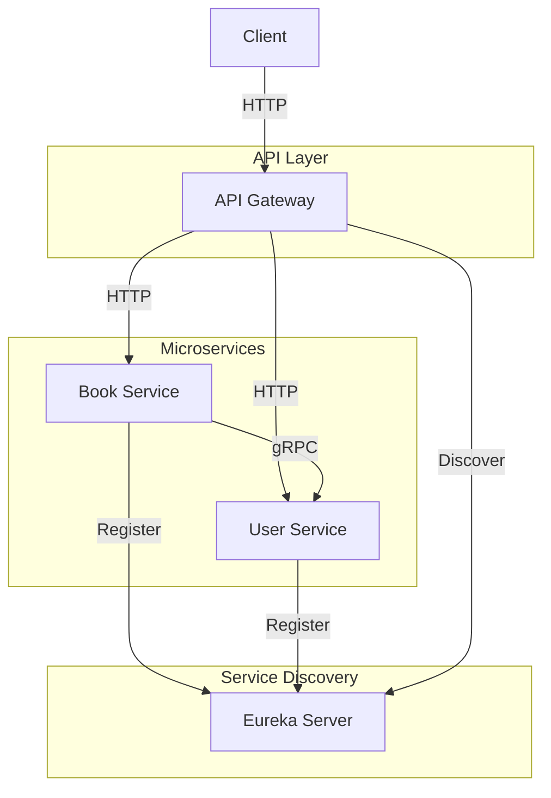
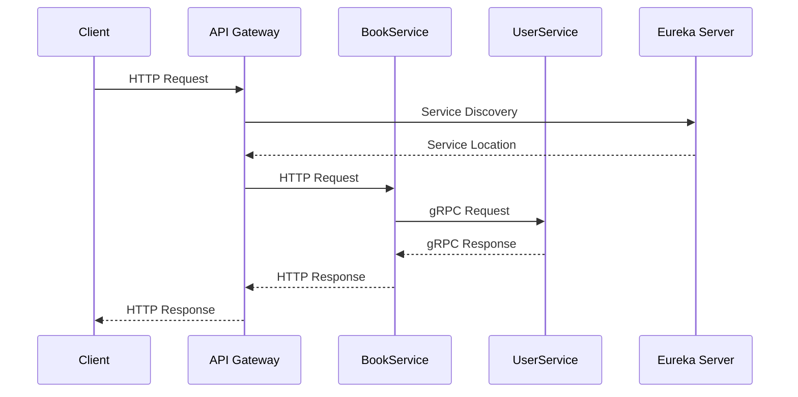
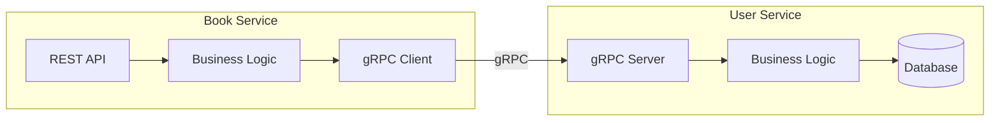

# Microservices with Spring Boot and Spring Cloud Gateway

This project demonstrates a microservices architecture using Spring Boot and Spring Cloud Gateway. It includes service discovery with Eureka, an API Gateway, and microservices with gRPC communication.

## High-Level System Design

### System Architecture


### Communication Flow


### Service Components


## Architecture

The project consists of the following components:

1. **Eureka Discovery Server** (Port: 8761)
   - Service registry and discovery server
   - Enables microservices to register and discover each other
   - Access the Eureka dashboard at http://localhost:8761

2. **API Gateway** (Port: 8765)
   - Built with Spring Cloud Gateway
   - Routes requests to appropriate microservices
   - Provides a single entry point for all client requests

3. **User Service** (Port: 8081)
   - Microservice for user management
   - Exposes gRPC endpoints for user operations
   - Registered with Eureka for service discovery
   - gRPC server running on port 9090

4. **Book Service** (Port: 8082)
   - Microservice for book management
   - Communicates with User Service using gRPC
   - Exposes REST endpoints for book operations
   - Registered with Eureka for service discovery

## Communication

### gRPC Communication
- User Service acts as a gRPC server
- Book Service acts as a gRPC client
- Communication is done using Protocol Buffers
- gRPC provides high-performance, type-safe communication

### REST APIs
- Book Service exposes REST endpoints for book operations
- API Gateway routes requests to appropriate services
- All services are accessible through the API Gateway

## Prerequisites

- Docker and Docker Compose
- Java 17 or later
- Maven
- Protocol Buffers compiler (protoc)

## Getting Started

1. Clone the repository:
   ```bash
   git clone https://github.com/luradata/microservices-spring-cloud-gateway.git
   cd microservices-spring-cloud-gateway
   ```

2. Build and start the services:
   ```bash
   make up
   ```

3. Verify the services are running:
   ```bash
   make ps
   ```

## Available Commands

- `make up`: Start all services
- `make down`: Stop all services
- `make restart`: Restart all services
- `make logs`: View service logs
- `make ps`: List running services
- `make clean`: Clean up Docker images
- `make help`: Display available commands

## Service URLs

- Eureka Dashboard: http://localhost:8761
- API Gateway: http://localhost:8765
- User Service REST: http://localhost:8081
- User Service gRPC: localhost:9090
- Book Service: http://localhost:8082

## API Endpoints

### Book Service
- `GET /api/books`: Get all books
- `GET /api/books/{id}`: Get book by ID
- `POST /api/books`: Create a new book
- `PUT /api/books/{id}`: Update a book
- `DELETE /api/books/{id}`: Delete a book

### User Service (gRPC)
- `GetUser`: Get user by ID
- `CreateUser`: Create a new user
- `UpdateUser`: Update user information
- `DeleteUser`: Delete a user

## Docker Network

All services are connected through a Docker network named `microservices-network`, enabling service-to-service communication.

## License

This project is licensed under the terms of the included [LICENSE](./LICENSE) file.
